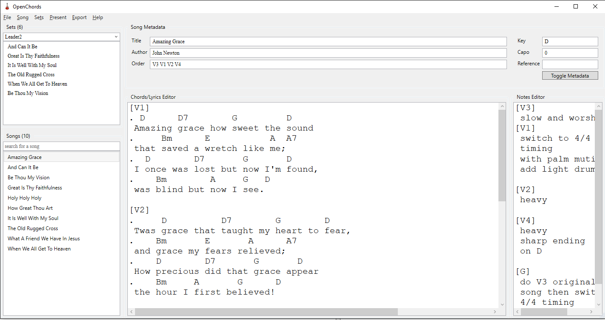
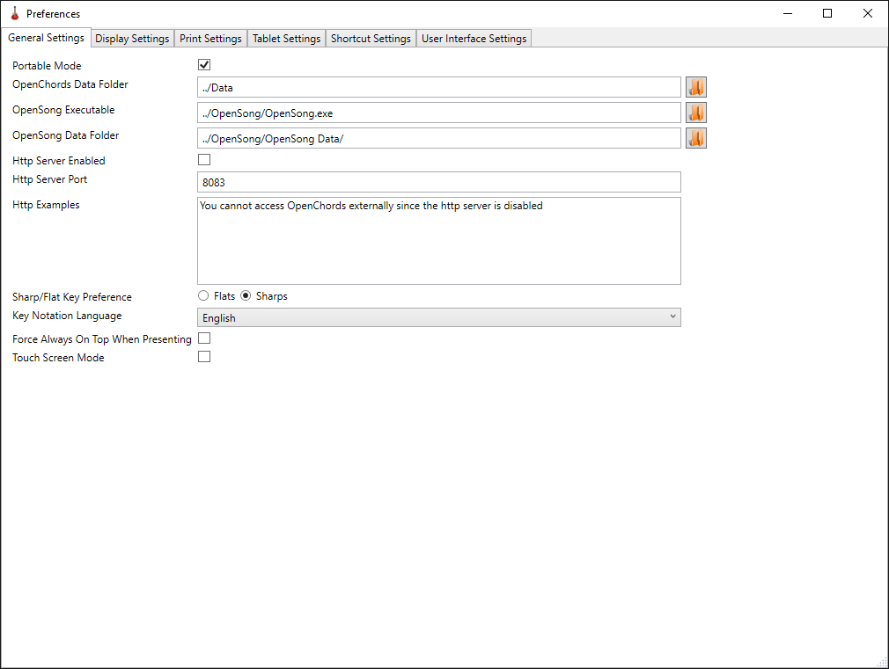
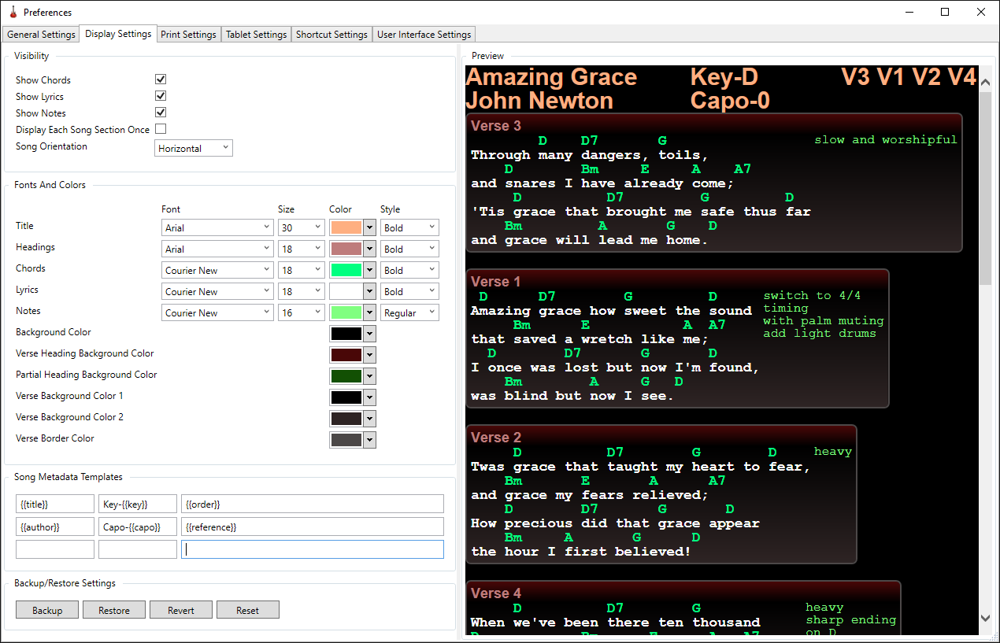
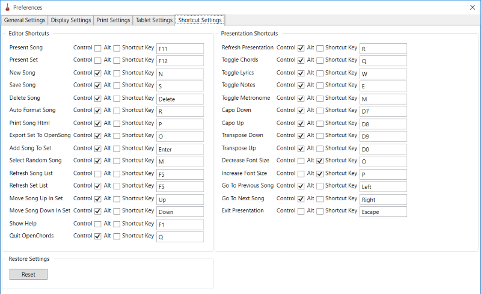
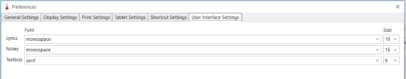
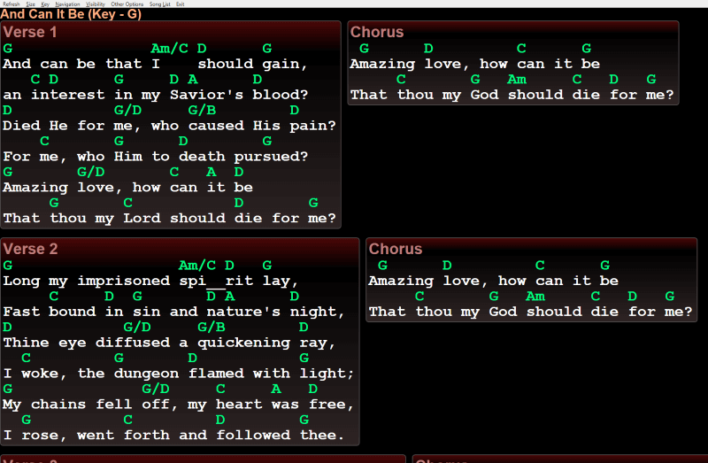

% OpenChords Help Documentation
% Author: Michael van Antwerpen
% Date: 2018-03-21

# Overview #

OpenChords is a song chords management and presentation tool for musicians. Allowing one to easily present songs with chords on a computer screen. It is open source, easy to use, and has a clutter-free interface.

# Background #

OpenChords was built to solve two primary needs:

* Easily transpose the key of a song
* I wanted a fully paperless system because filing music is tedious

The closest application I could find is the fantastic presentation software by the name of OpenSong. OpenSong allowed me to easily transpose and make printed sheets of songs. However this didn't solve my filing issue. I was then inspired to make paperless song system for musicians. Hence, OpenChords was born.

Fast forward a few years... My whole band uses OpenChords when we play in church. I use OpenChords whenever I record. I've been developing OpenChords in my free time for for the past eight years. It works on Windows and Linux. I hope you enjoy using it as much as I enjoyed making it.

If you wish to contact me for suggestions or to report bugs, you can
email me at <open.chords.app@gmail.com>

# Editor Screen #



This is the opening screen for OpenChords and this is where you will be adding and editing songs and adding these songs to sets.

## Menu ##

| Menu Items                   | Description                                               |
|------------------------------|-----------------------------------------------------------|
| File >> Preferences          | Change application settings and configure display options |
| File >> Quite                | Exit OpenChords                                           |
| Song >> File Operations      | Create/Delete/Save/Revert a song                          |
| Song >> Song Key             | Increase or decrease song key                             |
| Song >> Capo                 | Increase or decrease song capo                            |         | Song >> Auto Format Song     | Tries to format the song in the OpenChords format         |
| Song >> Refresh              | Refreshes the songs list                                  |
| Set >> File Operations       | Create/Delete/Save/Revert a set                           |
| Set >> Refresh               | Refreshes the sets list                                   |
| Present >> Present Song      | Present the currently selected song in fullscreen mode    |
| Present >> Present Set       | Present the currently selected set in fullscreen mode     |
| Export >> Export to print    | Export to html using the print display settings           |
| Export >> Export to tablet   | Export to html using the tablet display settings          |
| Export >> Export to OpenSong | Export songs to be used in OpenSong                       |
| Export >> Export set list    | Exports the current set to a text file for easy printing  |

## Song List ##

This is the list of songs that you have in your song collection.
If you right click on the song you can use the "Add to set" context menu to add the currently selected song into the currently selected set.

> **Tip1:** If you want to search for a song, just start typing in the search box. By default we search on the following metadata: 'title', 'alternative title', 'author', 'reference', 'sub-folder', 'ccli', The list of songs will be filtered. You can also search on phrases by enclosing the search term in double quotes e.g. "Amazing Grace"
>
> **Tip2:** If you want to search on the lyrics of a song. Simply press the "Enter" key and then the search will include a full text search of the 'lyrics'.
>
> **Tip3:** If you want to see the song in the file system just click Song >> File Operations >> Explore options and it will open Windows Explorer with that song selected.
>
> **Tip4:** Double click on any song to add it to the current set

### Song List Context Menu ###

| Context Menu Item  | Description                                                 |
|--------------------|-------------------------------------------------------------|
| Add To Set         | Adds the currently selected song to the current set         |
| Delete Song        | Deletes the current song (note: this is not reverseable)    |
| Select random song | Picks a random song in the list                             |

## Sets ##

A set is simply a name for a list of songs. I usually have a set per worship leader or the name of your gig. The songs are presented in the order that you choose in your set.

### Set Context Menu ###

| Context Menu Item    | Description                                            |
|----------------------|--------------------------------------------------------|
| Move song up         | Move the currently selected song up in the set list    |
| Delete song from set | Deletes the current song from the set                  |
| Move song down       | Move the currently selected song down in the set list  |

### Song Metadata ###

This is information describing your song.

#### Default Metadata tables ####

**Title:** this is just the name of your song.

**Author:** Just the author of the song

**Order:** This is the order in which you would like the pieces/sections of the song
to appear

```text
e.g. V1 C V2 C2 E will display Verse 1, Chorus, Verse 2, Chorus 2,
Ending

There are a number of letters used for pieces/sections of the song:
I = Intro or interlude
C = Chorus
P = Pre-Chorus
B = Bridge
V = Verse
E = Ending
```

> Note: You can use any other letters and number combinations but only the
ones above will get converted to more user friendly names when you
choose to present the song(s)

**Key:** Current key of the song

**Capo:** Capo position

**Reference:** Other reference information e.g. SOF205

#### Other Metadata tags ####

These are additional tags that are present when you click on the "Toggle Metadata" button

**Alternative Title:** Some songs or known by another title

**Sub-Folder:** Puts songs in another physical folder. Useful for categorising your music

**Copyright:** Copyright information for the song

**CCli:** Christian Copyright Licensing International

**Bpm:** Beats per minute

**Tempo:** Options are very fast, fast medium, slow, very slow

**Time Signature:** 2/4, 3/4, 4/4 etc

## Chords/Lyrics Editor ##

In order to display the chords and lyrics and sections properly we use a
simple syntax for the first character in each line.

| Syntax      | Line description                             |
|----------   |----------------------------------------------|
| "." (dot)   | a chord line                                 |
| " " (space) | a lyrics line                                |
| \[x\]       | name of the verse where *x* is I, C1, V6 etc |

## Note Editor ##

These notes are to remind you how to perform the song while the song is
being presented in full screen view. e.g. who is performing the song intro, when does the bass guitarist come in, who is singing solo parts in the verses.

> **Note:** Make sure that the notes are in the same order as your presentation order
>
> **Tip:** Press Ctrl+R (Auto Format Song) before you start filling in the song notes as it will fill in the piece/section placeholders for each note for you

# Preferences #

## General Settings ##

> **Note:** you can use both relative and absolute paths.



**Portable Mode** - if this is checked, OpenChords will store its settings file in the same folder where OpenChords is running from ("settings.xml"). Portable mode is useful if you want to run OpenChords from a flash drive or share OpenChords over sync OpenChords accross multiple computers using a tool such as Dropbox

**OpenChords Data Folder** - this is the folder where OpenChords keeps
its songs, sets, display settings and exported files.

**OpenSong Executable** - The path and executable for OpenSong e.g. "C:/program files (x86)/OpenSong/OpenSong.exe"

**Opensong Songs and Sets Folder** - The path that OpenSong stores its
Songs, Sets, Backgrounds and settings. usually "c:/{userfolder}/My Documents/OpenSong"

**Http Server Enabled** - If this is enabled an embedded http server. note: you might get a firewall warning if this setting is enabled

**Http Server Port** - The port on which the embedded http server listens (default 8083)

```text
e.g.
http://{your ip address}:{selected port}/song will render the currently selected song on another device
http://{your ip address}:{selected port}/set will render the currently selected set on another device
```

**Sharp/Flat Key Preference** - E.g. if you select Flats you will see "Ab", "Bb", "Db" etc. Alternatively if you select Sharps you will instead see "G#", "A#", "C#"

**Key Notation Language** - Different countries have different music chords currently your options are English and German

**Force Always On Top When Presenting** - Don't allow other windows to steal focus when presenting in full screen presentation mode

**Touch Screen Mode** - Add buttons on the edges in full screen presentation mode for scroll down/up and move to next/previous song.

## Display/Print/Tablet Settings ##

These settings are used to tweak how your song will display/print



**Show Chords** - whether display chords when you presenting the songs

**Show Lyrics** - whether to display the lyrics when you presenting the song.

**Show Notes** - whether to display the song notes when you presenting the song.

**Display Each Song Section Once** - E.g. if your order is "V1 C V2 C V3 C B B C" if you select this option the following sections will be displayed "V1 C V2 V3 B". This option is useful for saving paper when printing the songs or for people that don't like having to change screens as frequently.

**Song Orientation** - Either horizontal (left to right song section allignment) or vertical (top to bottom song section allignment)

**Fonts and Colors** - choose the Font, Size, Color and Font Style for almost all the elements that are displayed or printed

**Song Metadata Templates** - You can customize what items are visible in the header information for the song. The textboxes are aligned in the same ordering to the display preview to the right. There are a number of placeholders that you can use for displaying your song metadata. Note these placeholders are case sensitive and MUST be in the following format {{placeholder}}. You can type ANY text between the placeholders. e.g. "Key-{{key}}"

|                        |                        |                        |
|------------------------|------------------------|------------------------|
| {{title}}              | {{alternative-title}}  | {{reference}}          |
| {{key}}                | {{capo}}               | {{author}}             |
| {{order}}              | {{ccli}}               | {{tempo}}              |
| {{time-signature}}     | {{bpm}}                | {{copyright}}          |

**Backup/Restore Settings** - Here you can backup your current settings to a file, restore backed up settings or reset your display settings back to default

**Tip1:** Make sure you select the same font and size for Chords and lyrics otherwise chords may not match up with your lyrics

## Shortcut Settings ##

You can customize any of the keyboard shortcuts in OpenChords.



The following shortcut keys will not work because they are already used in IE (even though they are disabled):

* Ctrl+A
* Ctrl+F
* Ctrl+L
* Ctrl+N
* Ctrl+O
* Ctrl+P

The following shortcut keys will not work because they are not recognised in Eto.Forms:

* OemPlus
* OemMinus
* Punctiation marks
* Square brackets
* Slash and backslash

## User Interface Settings ##

These settings allow you to change the fonts and font sizes used in the lyric/notes editor screens



**Lyrics** - change the font and font size of the "Chords/Lyrics Editor"

**Notes** - change the font and font size of the "Notes Editor"

**Textboxes** - change the font and font size of all the "Song Metadata" textboxes and search boxes`

# Song/Set Presentation #



> **Note:** Song elements are read from left to right if you using **horizontal screen orientation** otherwise the song elements will be from top to bottom
>
> **Tip1:** You can use the "spacebar" key to move to the next page
>
> **Tip2:** you will need to press the Escape key to leave the presentation.

# Hotkeys #

There are a couple of shortcuts in OpenChords that will hopefully make your life a little easier. They are customizable under Preferences >> Shortcut Settings

## Editor shortcuts ##

| Shortcut | Description                          |
|----------|--------------------------------------|
| Ctrl+N   | Creates a new blank song             |
| Ctrl+S   | Saves the selected song to disk      |
| Ctrl+R   | Attempts to fix the song formatting. |
| Ctrl+F   | Opens advanced song search.          |
| Ctrl+P   | Exports and opens song in browser    |
| F11      | Presents the selected song           |
| F12      | Presents all songs in the set        |
| Ctrl+0   | Increases song key                   |
| Crtl+9   | Decreases song key                   |
| Ctrl+8   | Increases capo                       |
| Crtl+7   | Decreases capo                       |

## Presentation shortcuts ##

| Shortcut   | Description                          |
|------------|--------------------------------------|
| Up         | Go to previous page                  |
| Down/Space | Go to next page                      |
| Ctrl+Left  | Go to previous song                  |
| Ctrl+Right | Go to next song                      |
| Alt+1..9   | Goes to the song 1-9                 |
| Alt+L      | List of all songs in the set         |
| Alt+O      | Decreases font size                  |
| Alt+P      | Increases font size                  |
| Ctrl+0     | Increases song key                   |
| Ctrl+9     | Decreases song key                   |
| Ctrl+8     | Increases capo                       |
| Ctrl+7     | Decreases capo                       |
| Ctrl+Q     | Toggle chords                        |
| Ctrl+W     | Toggle lyrics                        |
| Ctrl+E     | Toggle notes                         |
| Escape     | Closes the song presentation window  |
| Ctrl+M     | Starts/Stops the metronome           |

# Tips and tricks #

## The Auto Format Song Menu Item ##

This feature attempts to transform the song that you entered in a presentable format. That is, it guesses what lines are chord lines and what lines are lyric lines etc. It also adjusts the notes in the notes panel to following the order of the song that you chose in the order text field.

You want to use this feature when:

* Changing the song presentation order so the song notes get adjusted
* Adding a new song so you don't have to manually identify which rows are chords

> **Note:** You can use Ctrl+R to quickly reach this feature.

## Using OpenChords with Tablets and Cellphones ##

OpenChords has a small embedded http server to accomplish this task.

These are the steps you need to follow to use the embedded http server:

* Open preferences via File >> Preferences

* Enable the **HTTP Server** and set the **HTTP Server Port**

> Acceptable ports are in the range of 1024-65535


* Restart OpenChords

* You might get a firewall warning. **Allow Access** for private (or domain/public if you wish) networks


* Connect to the OpenChords from another device using the address in the **http examples** text box

> In this sample you would connect to <http://192.168.0.4:8083/song>
> Note: the device you connecting to OpenChords needs to be on the same network

* You can select the display settings to use and display the current set if you wish. See below for examples

```text
http://{your ip address}:{selected port}/song will render the currently selected song on another device
http://{your ip address}:{selected port}/set will render the currently selected set on another device
http://{your ip address}:{selected port}/song/print will render the currently selected song using your selected print settings
http://{your ip address}:{selected port}/song/tablet will render the currently selected song on another device using your selected tablet settings
```

## Integration with OpenSong ##

OpenChords has been built to work well with OpenSong, which is an excellent church projection software.

These are the steps you need to follow to be able to export songs and sets into OpenSong:

* Open preferences via File >> Preferences

* Set the location of your **OpenSong.exe** executable and the path to your **OpenSong data folder**

  > OpenSong is typically located in c:/program files (x86)/OpenSong/OpenSong.exe
  >
  > OpenSong Data Folder is typically located in c:/users/%Your User Name%/OpenSong

  

* Restart OpenChords

* Select Export >> Export To OpenSong >> Export Current Set and your set will be exported to OpenSong and then OpenSong will be opened

* Find your set in OpenSong and present your set.

* If you want to have images for each of your songs, you will need to make a **.jpg** (not a jpeg) file with the exact same name as the song you exporting (note: filenames are case sensitive). For clarity, please see the file system diagram below

```text
+-- Backgrounds
|   +--OpenChords
|      +--Be Thou My Vision.jpg
|      +--The Old Rugged Cross.jpg
+-- Sets
| +--Leader 1
+-- Songs
|   +--OpenChords
|      +--Be Thou My Vision
|      +--The Old Rugged Cross
|      +--And Can It Be
```

> In this example we have Exported Set "Leader 1" which has 3 songs "Be Thou My Vision", "The Old Rugged Cross" and "And Can It Be".
> The song "And Can It Be" will NOT have pre set background image because there is no corresponding "And Can It Be.jpg" file.